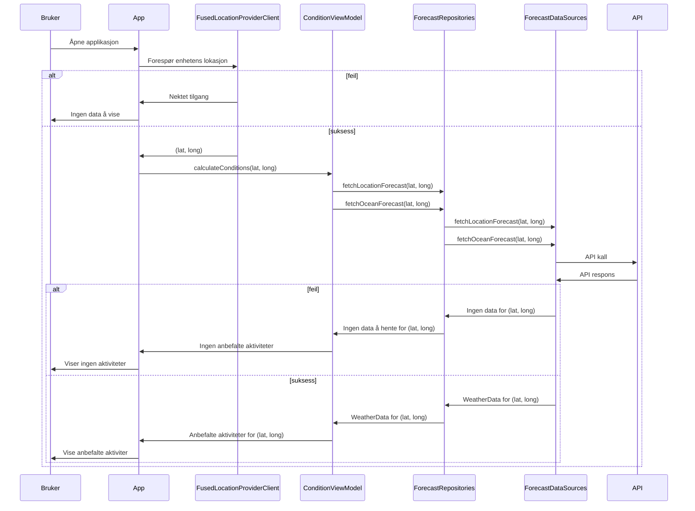
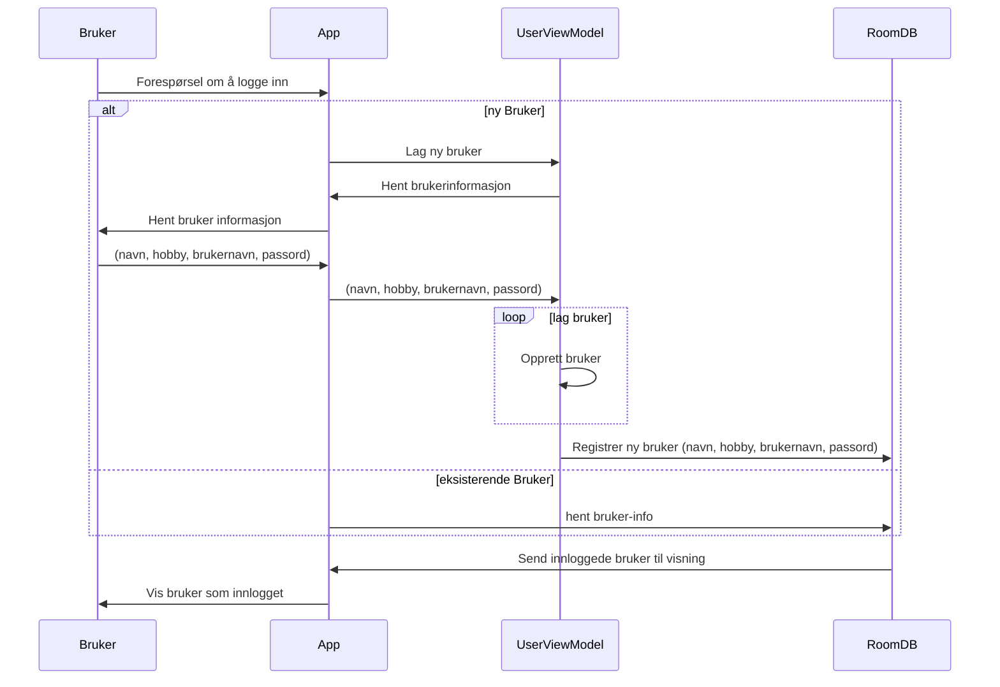
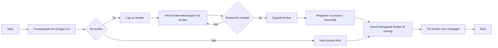
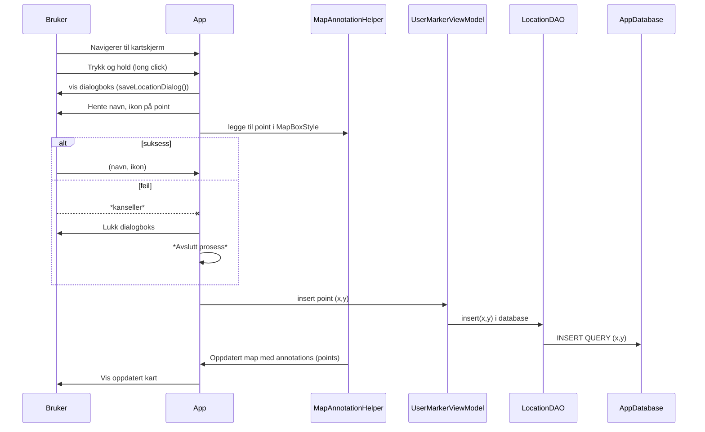

# Modeling

## Innholdsfortegnelse

- [[#De viktigste funksjonelle kravene til appen|De viktigste funksjonelle kravene til appen]]
		- [[#Bruker skal kunne se oppsummering av været på et tidspunkt|Bruker skal kunne se oppsummering av været på et tidspunkt]]
		- [[#Bruker skal kunne legge til favorittpunkt på kartet|Bruker skal kunne legge til favorittpunkt på kartet]]
		- [[#Bruker skal få anbefalt aktiviteter for valgt tidspunkt gitt været i området|Bruker skal få anbefalt aktiviteter for valgt tidspunkt gitt været i området]]
		- [[#Bruker skal kunne opprette en profil på appen|Bruker skal kunne opprette en profil på appen]]
- [[#Diagrammer|Diagrammer]]
	- [[#Diagrammer#1. Skaffe anbefalinger for nåværende posisjon|1. Skaffe anbefalinger for nåværende posisjon]]
	- [[#Diagrammer#2. Opprette en bruker|2. Opprette en bruker]]
	- [[#Diagrammer#3.  Bruker kunne se været på et tidspunkt|3.  Bruker kunne se været på et tidspunkt]]
	- [[#Diagrammer#4. Favorittsted på kartet|4. Favorittsted på kartet]]

## De viktigste funksjonelle kravene til appen

Appen har i hovedsak fire *større* funksjonaliteter som utgjør kjernen av hva appen gjør. For å oppnå disse funksjonelle kravene er det også mindre funksjonelle krav, men vi setter lys på de vi mener er viktigst og bidrar mest til forståelsen av hvordan appen fungerer i dette dokumentet. I disse diagrammene har vi forenklet flyten der det er naturlig, fordi vi har avgjort at det overordnede bildet bidrar mer til forståelse enn at sekvensen av hendelser er helt teknisk korrekt. Disse funksjonelle er:

1. Bruker skal kunne se en oppsummering av været på et tidspunkt
2. Bruker skal kunne legge til favorittsteder på kartet
3. Bruker skal få anbefalt aktiviteter for et valgt tidspunkt gitt været i området
4. Bruker skal kunne opprette en profil på appen

#### Bruker skal kunne se oppsummering av været på et tidspunkt

**Navn:** Bruker skal kunne se været på et tidspunkt

**Prebetingelser:**

- Brukeren har installert appen/emulerer appen og gitt de nødvendige tillatelsene for lokasjonstjenester dersom værdata skal hentes basert på nåværende posisjon.
- Brukeren har internettforbindelse for å hente værdata.
- Appen har tilgang til en pålitelig værdatakilde (API) som kan levere historiske, nåværende og prognoser for fremtidige værforhold.

**Postbetingelser:**

- Brukeren skal ha blitt presentert med værdata for det valgte tidspunktet og datoen på en klar og forståelig måte.
- Den valgte dato og tidspunkt for værdata lagres i brukerens historikk eller sesjon for eventuell fremtidig referanse eller gjentakelse av oppslag.
- Ved eventuelle feil eller manglende data, skal brukeren motta en passende feilmelding eller informasjon om dataenes tilstand.

**Beskrivelse:** Denne funksjonen tillater brukeren å få opplysninger om værforholdene på et spesifikt tidspunkt i fortiden, nåtiden, eller fremtiden. Opplysningene kommer til syne gjennom et kort på hjemskjermen.

**Brukerflyt:**

1. Når brukeren åpner appen, vil hovedskjermen vise nåværende værforhold basert på brukerens lokasjon eller valgt sted.
2. For å se været på et tidspunkt X, trykker brukeren på en "Tidspunktsvelger" som består av en datovelger og en klokkslett velger.
3. En kalendervisning kommer opp hvor brukeren kan velge dato og klokkeslett.
4. Brukeren kan bla gjennom kalenderen for å finne ønsket dato og tidspunkt, ved lukking oppdateres været automatisk.
5. Appen vil nå hente værdata fra en hvis det behøves ny data, eller vise eksisterende data om det finnes.

#### Bruker skal kunne legge til favorittpunkt på kartet

**Navn:** Bruker skal kunne legge til favorittpunkt på kartet

**Prebetingelser:**

- Brukeren har åpnet appen og har gitt de nødvendige tillatelsene for å bruke kart- og lokasjonstjenester.
- Brukeren har tilgang til internett.

**Postbetingelser:**

- Brukerens valgte lokasjon er markert som et favorittpunkt på kartet og lagret innen appens lokale database knyttet til brukerens konto.
- Den nye favorittmarkøren er synlig på kartet med et navn og ikon som angitt av brukeren.
- Brukeren skal ha muligheten til å interagere med de lagrede favorittpunktene.

**Beskrivelse:** Denne funksjonen gir brukeren muligheten til å markere og lagre sine favorittsteder på kartet i appen. Disse markøene har en tilhørende aktivitet.

**Trinn:**

1. Når brukeren har åpnet appen, navigerer de til kartskjermen.
2. Brukeren navigerer kartet for å finne lokasjonen de ønsker å markere som favoritt.
3. Ved å trykke og holde på en spesifikk lokasjon på kartet, vil et alternativ for å "Lagre markør her" dukke opp.
4. Etter å ha valgt dette alternativet, kan brukeren gi stedet et tilpasset navn og eventuelt velge et ikon som representerer typen sted.
5. Brukeren bekrefter lagring ved å trykke på "Lagre".
6. Når stedet er lagret, vises det på kartet med det valgte navnet og ikonet, og blir lagret i kartet.
7. Brukeren kan deretter enkelt se alle sine lagrede favorittpunkter på kartet.

#### Bruker skal få anbefalt aktiviteter for valgt tidspunkt gitt været i området

**Prebetingelser:**
- Brukeren har en aktiv gps forbindelse.
- Appen har tilgang til en værtjeneste gjennom en API som kan levere "sanntid" værdata (met apier).
- MET-APIen kan gi data som er relevante for å foreslå aktiviteter (eks. temperatur, nedbør, vindforhold, bølgehøyde).

**Postbetingelser:**
- Brukeren har mottatt personlig tilpassede aktivitetsforslag basert på nåværende værforhold på sin lokasjon.
- Dersom appen ikke får tilgang til lokasjon eller værdata, vises en passende feilmelding til brukeren (mangler værdata).
- Eventuelle data spørringer og beregninger for aktivitetsanbefalinger må skje uten at det går utover appens ytelse eller brukeropplevelsen (coroutines).

**Trinn:**

1. Brukeren åpner applikasjonen og interagerer for å få aktivitetsforslag basert på nåværende værforhold.
2. Appen forespør lokasjonen fra brukerens enhet ved hjelp av FusedLocationProviderClient.
3. Dersom lokasjonstilgang er nektet, informeres brukeren om at det ikke er mulige data å vise.
4. Hvis lokasjonstilgang gis, sender FusedLocationProviderClient tilbake latitude og longitude (lat, long) til appen.
5. Appen beregner aktuelle forhold ved hjelp av ConditionViewModel og henter værdata basert på lokasjonen fra ForecastRepositories.
6. ForecastRepositories forespør værdata og havforhold for lokasjon (dersom relevant) fra ForecastDataSources.
7. ForecastDataSources utfører API-kall til en værtjeneste og venter på respons.
8. Ved feil eller manglende data returneres en feilmelding opp gjennom stakken, og appen informerer brukeren om at ingen aktivitetsforslag kan gis.
9. Hvis værdata hentes suksessfullt, får ConditionViewModel værdata som deretter brukes til å foreslå relevante aktiviteter til brukeren.
10. Brukeren presenteres for de anbefalte aktivitetene basert på nåværende værdata for sin lokasjon.
#### Bruker skal kunne opprette en profil på appen

**Prebetingelser**:
- Brukeren har installert appen på sin enhet og har startet de
- Brukeren har ingen eksisterende brukerkonto i appen.

**Postbetingelser**:
- En brukerkonto for Brukeren er enten opprettet eller bekreftet som eksisterende i lokal database (roomDB).
- Brukeren er innlogget og får tilgang til appens funksjonalitet.

**Trinn:**
1. Bruker starter appen og blir presentert med et valg for å logge inn eller opprette en ny bruker.
2. Bruker velger å opprette en ny bruker.
3. Appen sender en metodekall til UserViewModel om å opprette ny bruker.
4. UserViewModel "spør" App/user interfacet om nødvendig brukerinformasjon for å opprette en ny profil. (navn, hobby, passord osv.)
5. Appen ber brukeren om å oppgi informasjon.
6. Bruker fyller inn og sender denne informasjonen tilbake til App.
7. App sender informasjonen til UserViewModel.
8. UserViewModel oppretter en brukerprofil-objekt.
9. UserViewModel fortsetter deretter med å registrere den nye brukeren i RoomDB.
10. Hvis det oppdages at brukeren allerede eksisterer, vil appen hente brukerinformasjon fra RoomDB.
11. RoomDB lagrer ny brukerinformasjon, eller returnerer informasjon om eksisterende bruker.
12. App viser bruker som innlogget.

**Alternativ Flyt**:
- Hvis brukeren allerede eksisterer, blir de informert om dette.
## Diagrammer

### 1. Skaffe anbefalinger for nåværende posisjon

### 2. Opprette en bruker

Med flytdiagram kan dette se omtrent slik ut:

### 3.  Bruker kunne se været på et tidspunkt

Denne er et biprodukt av diagram 1. Appen henter og fremstiller været som en underprosess av å anbefale aktiviteter.

### 4. Favorittsted på kartet

